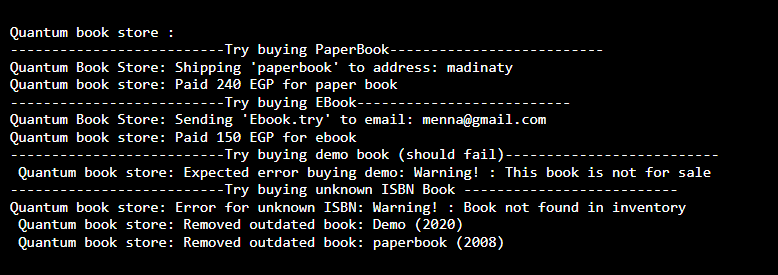

## 🧪 Sample Output

Here is the sample output of the program:


````markdown
# Quantum Bookstore Java Project

This is a console-based Java application that simulates an online bookstore. It supports different types of books (paper, ebook, demo), allows buying books, and removes outdated ones.

---

## 🧠 Object-Oriented Concepts Used

- **Abstraction:** Abstract class `Book` defines shared attributes and behaviors.
- **Inheritance:** `PaperBook`, `EBook`, and `ShowcaseBook` extend `Book`.
- **Polymorphism:** `deliver()` method behaves differently for each book type.
- **Encapsulation:** Book attributes are private/final with public getters.
- **Interfaces:** `ShippingService` and `MailService` are used for delivery logic injection.

---

## 🔧 Key Classes and Methods

| Class             | Key Methods / Purpose                                           |
|------------------|------------------------------------------------------------------|
| `Book` (abstract) | Base class for all book types (`deliver()`, `reduceStock()`)     |
| `PaperBook`       | Ships to address using `ShippingService`                        |
| `EBook`           | Sends to email using `MailService`                              |
| `ShowcaseBook`    | Not for sale (throws exception on `deliver()`)                  |
| `Bookstore`       | Manages inventory, `buyBook()`, `addBook()`, `removeOutdatedBooks()` |
| `QuantumBookstoreDemo` | Main class to test functionality                          |

## ▶️ How to Run

1. Install JDK 17+
2. Open in VS Code with **Java Extension Pack**
3. Press `F5` to run (make sure `launch.json` is configured)

---


